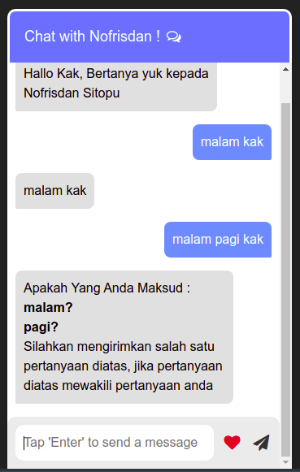

# Tentang Aplikasi 
Chatbot apps merupakan sebuah aplikasi chat otomatis berbasis website dengan menggunakan metode levensteinch distance

# Pengertian Metode
Levenshtein Distance atau sering disebut juga edit distance adalah suatu pengukuran metrik yang dihasilkan melalui perhitungan jumlah perbedaan jarak yang terdapat diantara dua untaian karakter string. Perbedaan yang diukur adalah jumlah minimal operasi penambahan insert, penghapusan delete dan penggantian karakter substitute yang dibutuhkan untuk meniadakan perbedaan diantara keduanya.

# Implementasi Aplikasi 



# Teknologi Yang digunakan 
<ul>
<li>Codeigniter 4</li>
</ul>

# Instalasi 
```
git clone https://github.com/Nofrisdan/Chatbot-apps.git
```
:warning: **JIKA ANDA INGIN MENGGUNAKAN APLIKASI INI SILAHKAN MENGHUBUNGI SAYA MELALUI EMAIL nofrisdansitopu22@gmail.com**:
